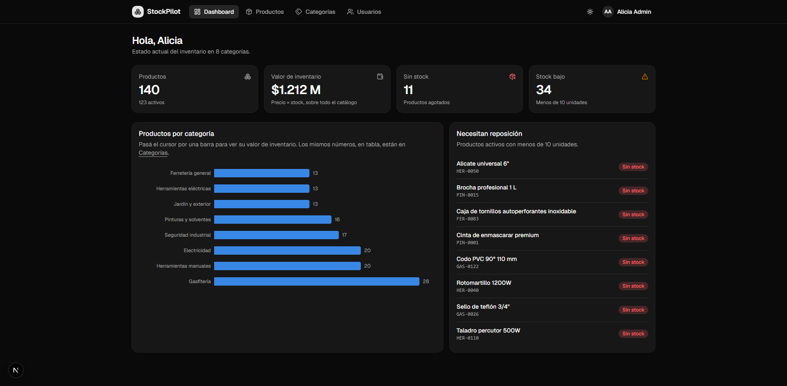
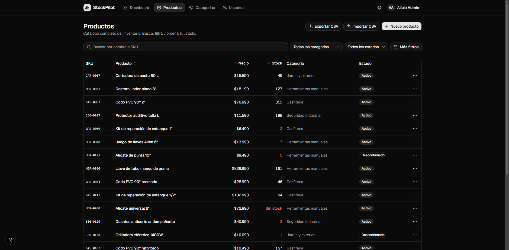
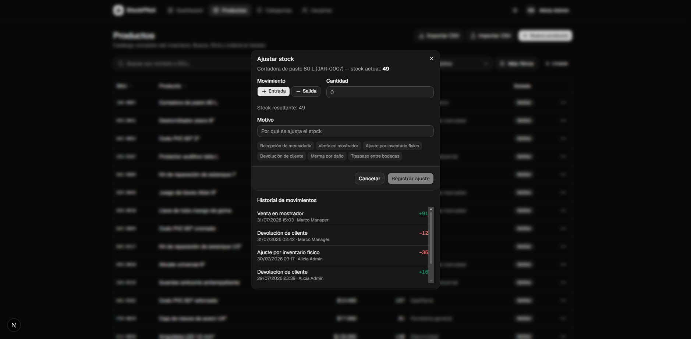

# StockPilot

Gestor de inventario y catálogo de productos para una ferretería ficticia. Aplicación
full-stack con autenticación por roles, SQL escrito a mano, carga y descarga de CSV, y un
dashboard con métricas agregadas.

> Proyecto personal de portafolio. Todos los datos son ficticios y generados por el seed.

[](https://github.com/Buakir/stockpilot/actions/workflows/ci.yml)


**▶ Demo en vivo:** <https://stockpilot-aburik-inc.vercel.app>  
Entra con `viewer@stockpilot.dev` / `demo1234` para recorrerla sin poder romper nada.



---

## Qué hace

- **Catálogo** — listado paginado con búsqueda por nombre o SKU, filtros combinables por
  categoría, estado, rango de precio y stock bajo, y orden por cualquier columna. Todo el
  estado del listado vive en la URL, así que un filtro se puede compartir por link.
- **CRUD** de productos y categorías, con validación en cliente y servidor.
- **Ajuste de stock** con auditoría: cada movimiento registra quién, cuándo, cuánto y por qué.
- **CSV** — exportación del catálogo filtrado e importación masiva con reporte de las filas
  rechazadas y el motivo de cada una.
- **Dashboard** — totales, valor de inventario, productos agotados y con stock bajo, gráfico
  de productos por categoría y lista de reposición.
- **Usuarios y roles** — tres niveles de permiso, gestionables desde la app por un admin.

|                                                                                          |                                                                                         |
| ---------------------------------------------------------------------------------------- | --------------------------------------------------------------------------------------- |
|  |  |
| Listado con filtros combinables, compartibles por URL                                      | Ajuste de stock con su historial de auditoría                                             |

## Roles

| Acción                    | admin | manager | viewer |
| ------------------------- | :---: | :-----: | :----: |
| Ver productos y dashboard |  ✅   |   ✅    |   ✅   |
| Crear / editar productos  |  ✅   |   ✅    |   ❌   |
| Ajustar stock             |  ✅   |   ✅    |   ❌   |
| Carga masiva CSV          |  ✅   |   ✅    |   ❌   |
| Eliminar productos        |  ✅   |   ❌    |   ❌   |
| Gestionar usuarios        |  ✅   |   ❌    |   ❌   |

La autorización se aplica **en el backend**, en cada API route. Ocultar botones en la UI es
sólo cosmético: una petición directa a la API con un rol insuficiente recibe un 403.

## Cuentas demo

Todas con la contraseña `demo1234`:

| Rol           | Email                    |
| ------------- | ------------------------ |
| Administrador | `admin@stockpilot.dev`   |
| Encargado     | `manager@stockpilot.dev` |
| Solo lectura  | `viewer@stockpilot.dev`  |

Para probar la app sin poder romper nada, entra con la cuenta de **solo lectura**.

---

## Correr en local

**Requisitos:** Node 20+ y Docker (o un PostgreSQL 15+ propio).

```bash
git clone <url-del-repo> stockpilot
cd stockpilot
npm install
```

Copia las variables de entorno y genera un secreto:

```bash
cp .env.example .env.local
npx auth secret
```

Levanta la base, aplica las migraciones y carga los datos de ejemplo:

```bash
npm run db:up && npm run db:migrate && npm run db:seed
```

```bash
npm run dev
```

La app queda en <http://localhost:3100>. Se usa el 3100 y no el 3000 porque en la máquina de
desarrollo ese rango lo tenía tomado Docker Desktop; el puerto se cambia en el script `dev`
de `package.json` (y en `AUTH_URL`, si corrés en local).

### Scripts

| Script               | Qué hace                                                      |
| -------------------- | ------------------------------------------------------------- |
| `npm run dev`        | Servidor de desarrollo                                        |
| `npm run build`      | Build de producción                                           |
| `npm test`           | Tests con Vitest                                              |
| `npm run typecheck`  | `tsc --noEmit`                                                |
| `npm run lint`       | ESLint                                                        |
| `npm run db:up`      | Levanta PostgreSQL en Docker (puerto 5433)                    |
| `npm run db:migrate` | Aplica las migraciones pendientes                             |
| `npm run db:seed`    | Carga datos ficticios (destructivo sobre las tablas de datos) |
| `npm run db:reset`   | Recrea el esquema desde cero y vuelve a sembrar               |

---

## Decisiones técnicas

### SQL a mano, sin ORM

El acceso a datos usa `pg` con consultas parametrizadas. La razón no es evitar un ORM por
principio, sino que el proyecto existe para mostrar SQL real: agregados condicionales,
funciones de ventana, bloqueos de fila.

Un ejemplo: el listado necesita las filas de la página **y** el total de coincidencias. En
vez de dos consultas que tendrían que repetir el mismo `WHERE` —y desincronizarse en cuanto
alguien toque una— el total sale de una función de ventana en la misma pasada:

```sql
SELECT p.*, c.name AS category_name, count(*) OVER () AS total_count
  FROM products p
  LEFT JOIN categories c ON c.id = p.category_id
 WHERE ...
 ORDER BY ... LIMIT $1 OFFSET $2
```

El dashboard hace algo parecido con `count(*) FILTER (WHERE ...)`: seis métricas en un solo
escaneo de la tabla en lugar de una consulta por tarjeta.

### Filtros dinámicos sin abrir la puerta a inyección

Los valores siempre van como parámetros (`$1`, `$2`…). Lo que no puede parametrizarse en SQL
es el **nombre de una columna**, y el listado acepta ordenar por la que el usuario elija. La
solución es una lista blanca: el `sort` que llega por la URL se usa como clave de un mapa, y
lo que se interpola en la consulta es el valor del mapa, nunca la entrada.

El mismo `WHERE` lo construye una única función compartida por el listado y la exportación:
si divergieran, el CSV que descarga el usuario no coincidiría con la tabla que está viendo.

### Autorización en el servidor

`lib/permissions.ts` es la única fuente de verdad sobre qué puede hacer cada rol. La usan
tanto la UI (para no ofrecer acciones que van a fallar) como cada API route, a través de
`requirePermission()`, que lanza un 403 tipado. La UI decide qué mostrar; el servidor decide
qué se puede hacer.

El test de la matriz reescribe la tabla de permisos a mano en lugar de derivarla del código:
un test que se calcula desde lo que prueba pasa siempre, incluso si alguien cambia un permiso
por error.

### Ajustar stock es una transacción, no un UPDATE

Cambiar el stock y registrar el movimiento ocurren en la misma transacción: nunca queda un
stock modificado sin saber quién lo modificó.

Además, la fila se bloquea con `SELECT ... FOR UPDATE` antes de leer el stock actual. Sin ese
bloqueo, dos salidas simultáneas de 6 unidades sobre un stock de 10 leerían ambas el mismo
valor inicial, las dos pasarían la comprobación y el stock terminaría en −2. Con él, la
segunda espera, ve el stock ya actualizado y recibe un 409.

### Los errores de la base no llegan al cliente

Todo lo que sale de una API route pasa por `toErrorResponse()`. Los errores de aplicación
llevan un código estable y un mensaje pensado para leerse; cualquier otra excepción —incluido
un error crudo de PostgreSQL— se registra en el servidor y se responde con un 500 genérico.

### Formateo determinista en vez de `Intl`

`Intl.NumberFormat` puede dar resultados distintos entre la base ICU de Node y la del
navegador (típicamente en el espacio que separa el símbolo de moneda), y eso produce errores
de hidratación al renderizar el mismo valor en servidor y cliente. Las funciones de
`lib/format.ts` devuelven siempre el mismo string, y hay tests que lo fijan.

### El acento de los gráficos no sale del tema

El preset de shadcn que usa el proyecto es monocromático: sus tokens `--chart-*` son grises
sin croma, y el primero (`#d4d4d4`) queda en 1.3:1 sobre la tarjeta blanca. Los gráficos usan
un `--chart-accent` propio, con un paso distinto para cada modo, verificado en 3:1 o más
contra la superficie real sobre la que se dibuja.

El gráfico del dashboard tiene una sola serie, así que usa un único color en vez de una
paleta categórica y no lleva leyenda —el título ya dice qué se mide—. Como cada barra muestra
su valor en la punta, el eje de valores y la rejilla se omiten por redundantes.

---

## Estructura

```
app/
├── (auth)/login/            # login con server action
├── (dashboard)/             # rutas protegidas
│   ├── page.tsx             # dashboard
│   ├── products/
│   ├── categories/
│   └── users/               # sólo admin
└── api/                     # autorización por rol en cada route
components/
├── ui/                      # shadcn/ui, sin modificar
└── ...                      # componentes propios por dominio
lib/
├── db.ts                    # pool de pg, query, withTransaction
├── auth.ts / auth.config.ts # Auth.js (config partida para Edge)
├── permissions.ts           # matriz de roles
├── queries/                 # acceso a datos
└── validators/              # esquemas Zod
db/
├── migrations/              # SQL versionado
├── catalog.ts               # vocabulario del seed
└── seed.ts
proxy.ts                     # protección de rutas (antes middleware.ts)
tests/                       # Vitest
```

## Tests

```bash
npm test
```

98 tests sobre lógica pura —matriz de permisos, validadores, parser y serializador CSV,
formateadores— sin base de datos ni servidor. No cubren las rutas HTTP ni el acceso a datos:
eso se verificó manualmente contra la app corriendo.

---

## Despliegue

Pensado para Vercel + PostgreSQL gestionado (Neon o Supabase).

1. Crea la base y copia su cadena de conexión. En Neon, usa la **pooled connection string**:
   cada instancia serverless abre su propio pool y sin el pooler se agotan las conexiones.
2. En Vercel, configurá las variables de entorno. `DATABASE_URL` y `AUTH_SECRET` hacen falta
   también durante el build, porque `lib/env.ts` las valida al importarse.

   | Variable       | Valor                            |
   | -------------- | -------------------------------- |
   | `DATABASE_URL` | cadena de conexión del proveedor |
   | `DATABASE_SSL` | `true`                           |
   | `AUTH_SECRET`  | salida de `npx auth secret`      |

   `AUTH_URL` no hace falta en Vercel: se infiere del dominio.

3. Aplica las migraciones apuntando a la base de producción. Las variables del shell tienen
   prioridad sobre `.env.local`, así que esto funciona sin tocar ningún archivo:

   ```bash
   DATABASE_URL="<cadena-de-produccion>" DATABASE_SSL=true npm run db:migrate
   ```

   En PowerShell:

   ```powershell
   $env:DATABASE_URL="<cadena-de-produccion>"; $env:DATABASE_SSL="true"; npm run db:migrate
   ```

4. Opcionalmente, sembrá los datos de demostración con el mismo procedimiento y `db:seed`.
   Es destructivo: no lo corras sobre datos que quieras conservar.

## Licencia

MIT.
